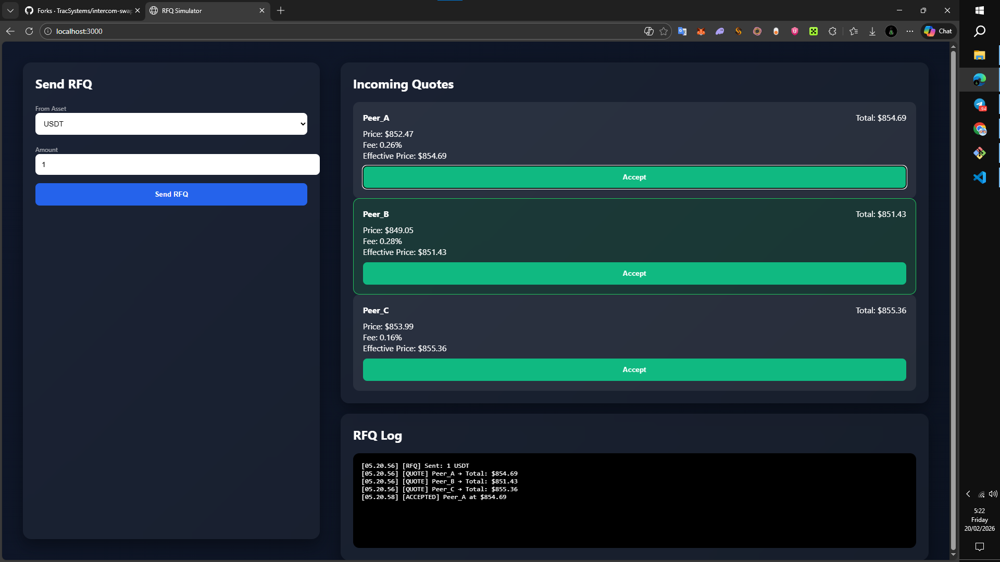

# RFQ Simulator



A professional Request For Quote (RFQ) simulation platform built with Node.js (Express) and a modern institutional-style UI.

---

## 📍 TRAC ADDRESS

```
trac1e3vrpk8g6j75fx0y3hrddu3v4czln8yrgu4p2xsylh4gg0vxxgvscslpaw
```

---

## Features

- Express backend API
- Simulated liquidity peers
- Randomized price + fee generation
- Effective price calculation
- Best quote auto-highlight
- RFQ log panel
- Institutional dark UI

---

## Project Structure

rfq-simulator/
│
├── server.js
├── package.json
└── public/
    └── index.html

---

## Installation

1. Install dependencies

npm install

If needed:

npm install express cors

2. Run server

node server.js

Server will run at:

http://localhost:3000

---

## API

POST /api/rfq

Request Body:

{
  "asset": "USDT",
  "amount": 1
}

Response Example:

{
  "timestamp": 1700000000000,
  "asset": "USDT",
  "amount": 1,
  "quotes": [
    {
      "peer": "Peer_A",
      "price": 852.47,
      "fee": 0.26,
      "effectivePrice": 854.69,
      "total": 854.69
    }
  ]
}

---

## Pricing Logic

Base Price = 850  
Price Fluctuation = ± random  
Fee = 0.10% – 0.40%  
Effective Price = price × (1 + fee/100)  
Total = effectivePrice × amount  

Best quote = Lowest Total Cost

---

## RFQ Flow

1. User selects asset
2. Enters amount
3. Clicks Send RFQ
4. Backend generates quotes
5. Frontend renders quotes
6. Best quote highlighted
7. User clicks Accept
8. Logged in RFQ Log

---

## Future Improvements

- Quote expiration countdown
- WebSocket streaming
- Oracle simulation
- Spread analytics
- Smart routing engine
- Multi-asset pricing engine

---

## Disclaimer

This is a simulation tool.
No real trades occur.
No blockchain interaction.

---

## License

MIT

EOF